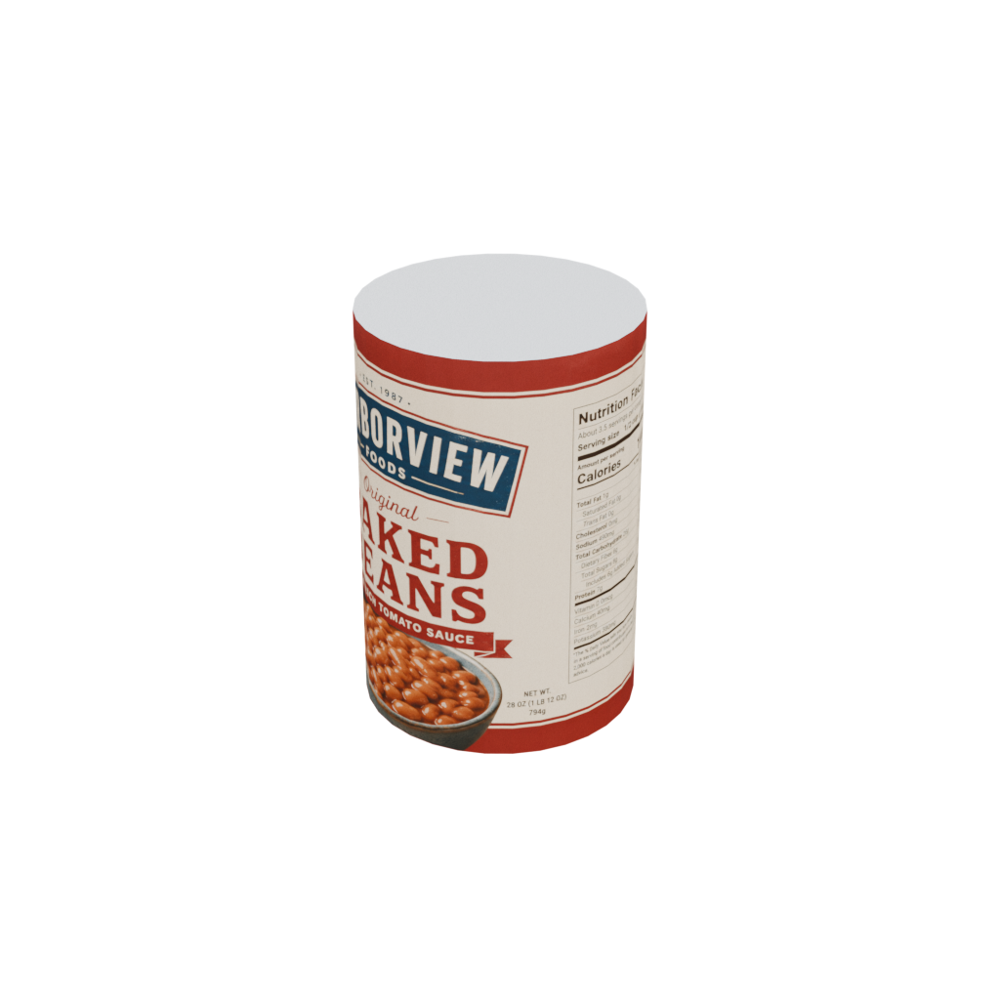
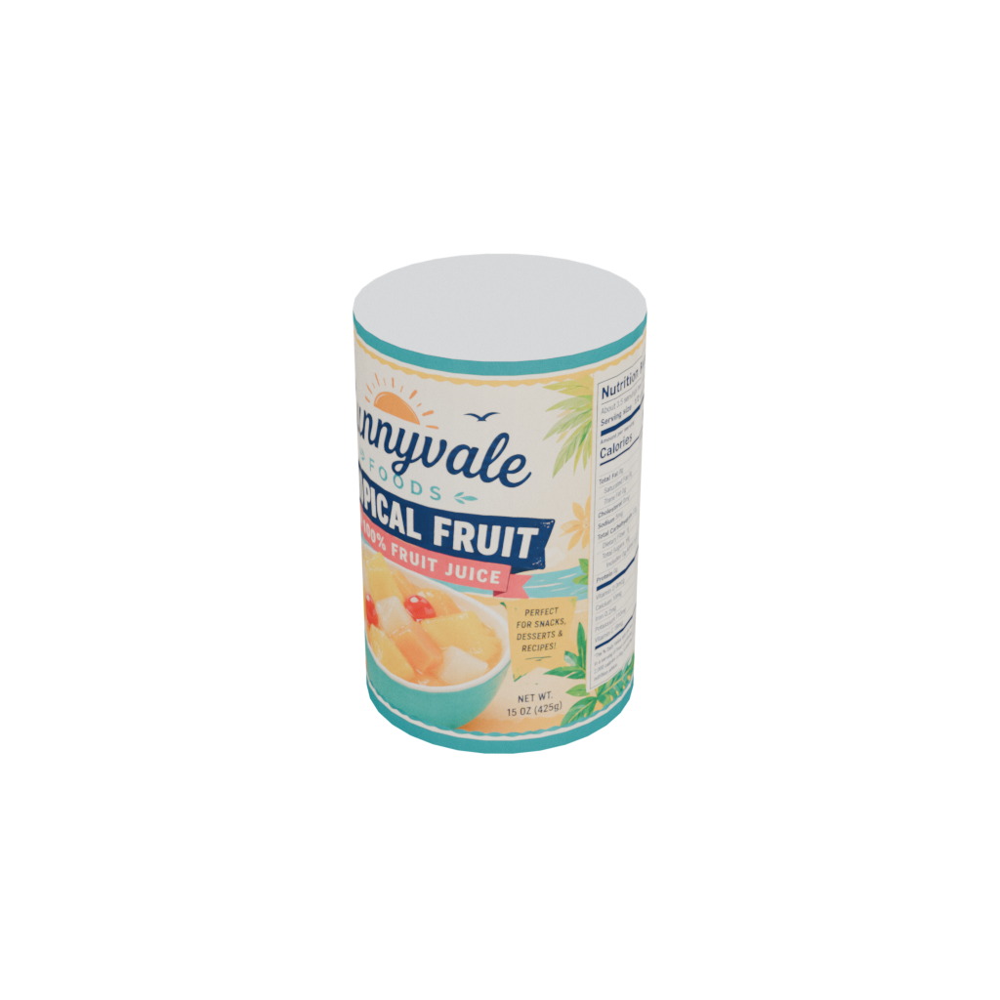
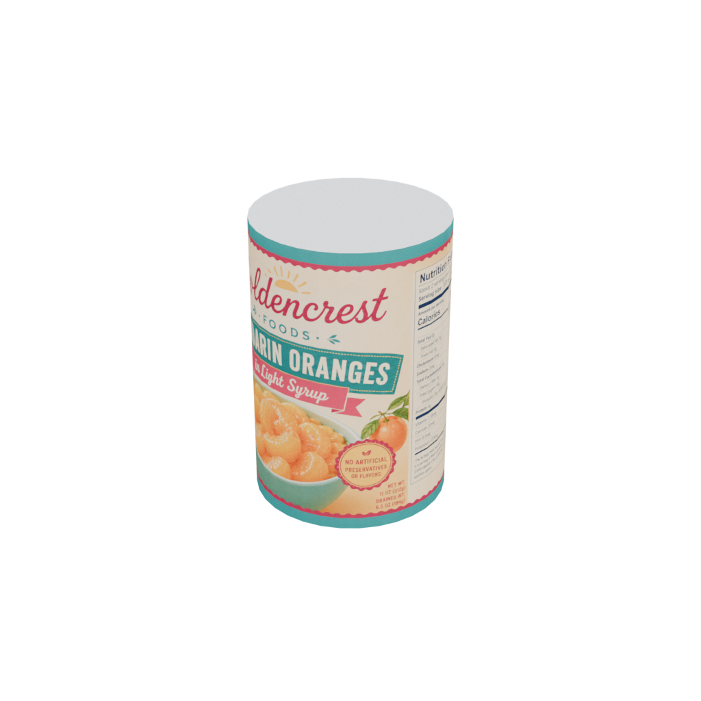
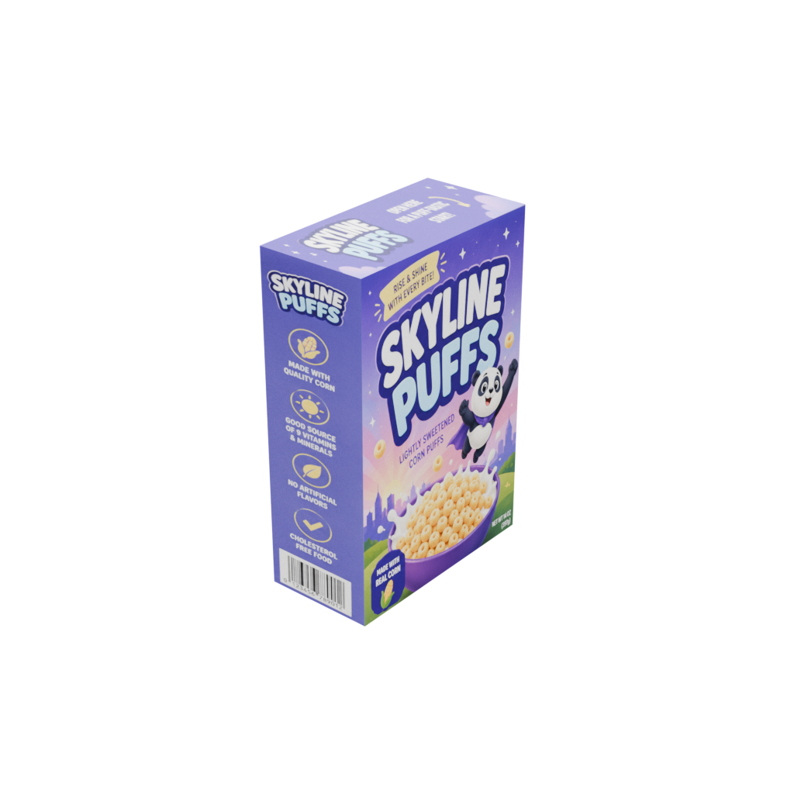
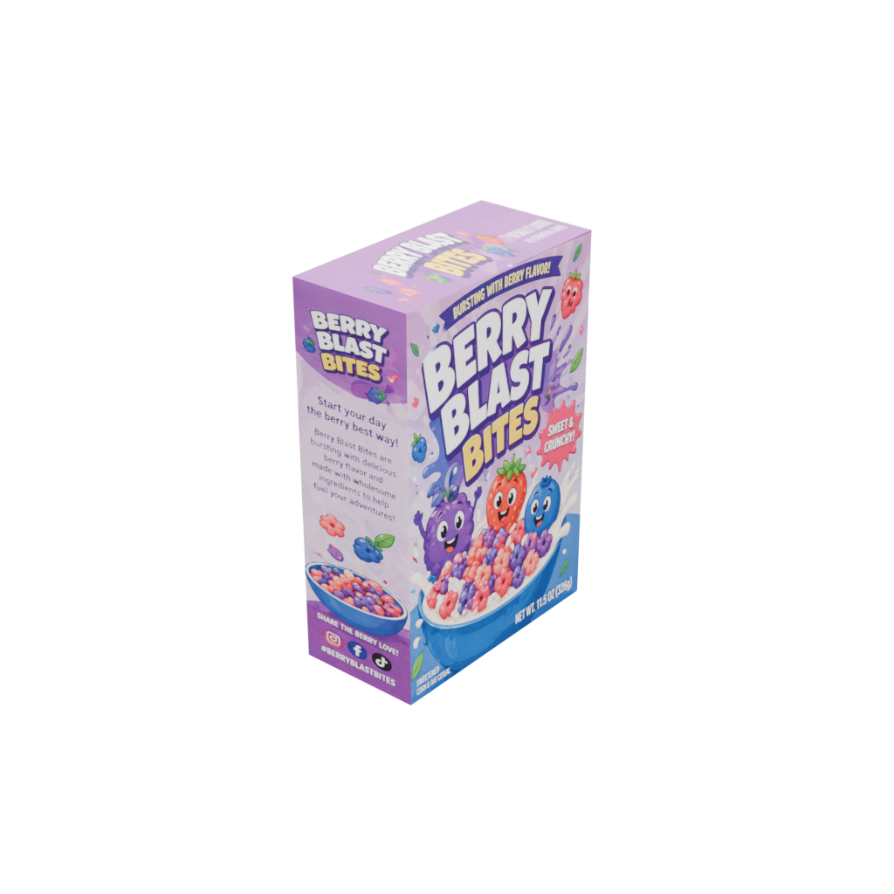

## stocktake-items
Collection of supermarket/grocery store/convenience store 3D models for simulation. Used as part of [autonomous stocktaking simulation](https://github.com/bulbeckh/stocktake/). Models are SDF models, built for Gazebo simulation. Meshes and textures (as GLB/GLTF2.0) are available in the 'generation/' folder.

#### Can
Dimension (m): height=0.15, radius=0.05
Four models of cans.

<table>
  <tr>
    <td>can1 to can4</td>
    <td>
        
        
        
        
    </td>
  </tr>
</table>

#### Cereal
Dimensions (m): x=0.1, y=0.2, z=0.3

Four models of cereal boxes.

<table>
  <tr>
    <td>cereal1 to cereal4</td>
    <td>
        
        
        
        
    </td>
  </tr>
</table>

### Running the viewer
The 3D models can be viewed in more detail using the viewer. Very simple three.js web viewer. Run by opening the `viewer.html` file in root directory. Some browsers may prevent loading files due to CORS policy. In that case, can you use a very simple python web server.

Start server and then navigate to http://localhost:8000/viewer.html
```bash
python3 -m http.server 8000
```
